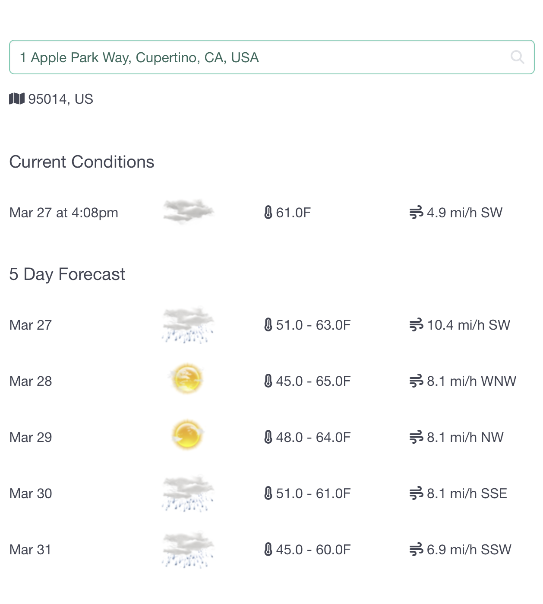
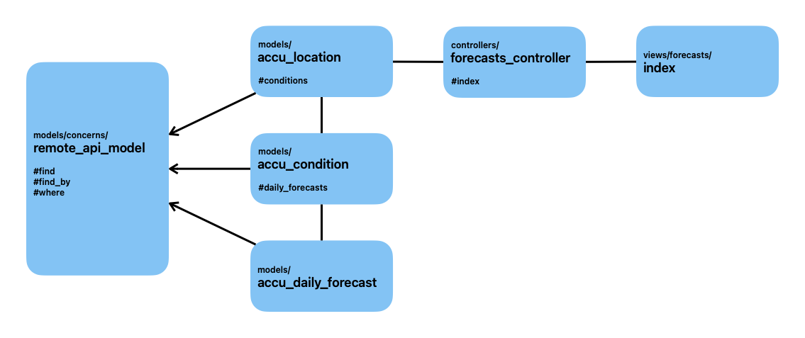

# Summary
This is a weather app with address autocomplete search bar. 
Current conditions and 5 day forecast are pulled and cached (using Rails solid cache) for 30 minutes for the requested location.
The address autocomplete is implemented using Google Maps API.
Weather is pulled from the Accuweather API.
API keys are stored using Rails credentials.
Rails master key is required for that to work.

For the sake of simplicity I implemented the back-end and UI using a single Rails app, instead of making it two projects (JSON API and a front-end UI e.g. written in React), so please let me know if implementing a JSON API was a crucial part of this assignment (it was not mentioned in the description). 

**IMPORTANT**
1. Ensure the Rails master key is set in the env var `RAILS_MASTER_KEY` or `config/master.key` file.
    The master key should have been sent separately in the email to the recruiter along with the project repo information.
2. The free version of the Accuweather API has a limitation of 50 requests per day, so hopefully that will not be exceeded during the evaluation of this project.

## Potential improvements
* To make it more scalable, we could implement a mechanism where weather data is pulled in the background in regular intervals for a given location, for locations perhaps most popular according to the search requests.
    We would need to store search requests to group them by popularity and implement a background jobs (likely using ActiveJob) for caching the forecasts in the background. 
* Use ActionCable to refresh the forecast without needing to reload the browser window.
* Pull weather from multiple sources and incorporate the differences in the UI. E.g.: show where the forecasts are radically different?

## Example of how the app looks like



## Run the app locally
**NOTE**: I wasn't sure how important docker setup was for this submission, but happy to provide it. 

```
cd weather
bundle install
bin/setup # or bin/dev for consecutive runs
open localhost:3000
```

## Run the tests
```
cd weather
bin/rails spec
```


# Main files forming part of this submission
## Application
```
# Controllers
app/controllers/forecasts_controller.rb
app/javascript/controllers/autocomplete_controller.js

# Models
app/models/search_query.rb
app/models/accu_location.rb
app/models/accu_condition.rb
app/models/accu_daily_forecast.rb
app/models/concerns/remote_api_model.rb

# Views
app/views/forecasts/_conditions.html.erb
app/views/forecasts/_search_query.html.erb
app/views/forecasts/index.html.erb
app/views/layouts/application.html.erb
```

## Tests
```
# Unit
spec/models/accu_location_spec.rb
spec/models/accu_condition_spec.rb

# Request
spec/requests/forecasts_spec.rb

# Feature
spec/features/forecasts_spec.rb

# Factories
spec/factories/accu_conditions.rb
spec/factories/accu_daily_forecast.rb
spec/factories/accu_locations.rb

# VCR fixtures for replaying the weather API interactions
spec/fixtures/vcr_cassettes/accu_locations/find_by_coordinates.yml
spec/fixtures/vcr_cassettes/accu_locations/conditions.yml
spec/fixtures/vcr_cassettes/accu_conditions/daily_forecasts.yml
spec/fixtures/vcr_cassettes/forecasts/index.yml

# Tests helper code
spec/vcr_helper.rb
spec/helpers/cache_helper.rb
spec/rails_helper.rb
spec/spec_helper.rb
```

## Diagram
Below is a simple objects diagram.
Weather domain objects are implemented using ActiveModel features with API interactions implemented in the RemoteAPIModel module.

